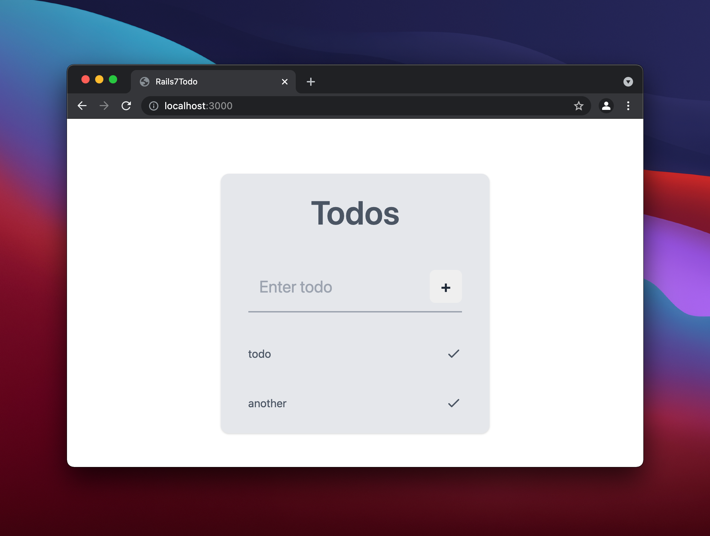

# Rails7-React-Todo

Testing out new features in Rails 7 for working with modern JavaScript tooling by making a localstorage-backed todo app.



- Rails 7
- esbuild
- React
- Tailwind CSS
- PostCSS

## Setup

### Prerequisites

- Ruby 3.0.2
- Node 16.9.0

```
git clone https://github.com/ethanfann/rails7-react-todo
cd rails7-react-todo && bundle install && npm install
./bin/dev
```

## Resources

[Rails 7.0 Alpha 1: New JavaScript Answers, At-Work Encryption, Query Origin Logging, Zeitwerk Exclusively](https://weblog.rubyonrails.org/2021/9/15/Rails-7-0-alpha-1-released/)

[Alpha preview: Rails 7 w/ esbuild + Tailwind CSS](https://www.youtube.com/watch?v=JsNtLiph87Y)

[jsbundling-rails - JavaScript Bundling For Rails](https://github.com/rails/jsbundling-rails)
